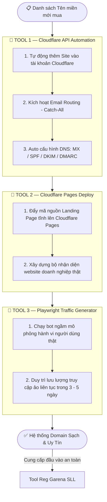

# 🚀 ToolACCGrn — Hệ Thống Tự Động Hóa Đăng Ký Tài Khoản Garena Quy Mô Lớn

## I. Tổng quan
1. **Mục tiêu:** Xây dựng hệ thống tự động hóa reg acc Garena số lượng lớn (SLL) trực tiếp trên máy thật (Native Python), tối ưu hóa hiệu năng logic và loại bỏ Docker.
2. **Triết lý phát triển:** Phát triển phiên bản DEMO rút gọn (dùng các tài nguyên miễn phí, có hạn, kết hợp với thủ công) để kiểm tra logic dòng chảy (flow). Sau đó nâng cấp/thay thế những modules lõi để tối ưu hóa hiệu suất, phá vỡ màng lọc bảo mật và kiểm soát chặt chẽ chi phí khi chạy SLL.

---

## II. Ma trận phát triển: DEMO vs PRODUCTION SLL

| Tên Module | DEMO | PRODUCTION SLL (Hạ Tầng Tối Ưu Cao) | Chi tiết kỹ thuật |
| :--- | :--- | :--- | :--- |
| **Browser Engine** | Undetected Chromedriver (UC) | **Playwright Async (Stealth Mode)** | UC chạy luồng chính ổn định ở mức cơ bản. Playwright Async tối ưu hóa xử lý bất đồng bộ, quản lý hàng trăm Browser Context cô lập diện rộng không ngốn tài nguyên. |
| **Kiến Trúc Vận Hành** | UI-Driven (Chạy form từ đầu đến cuối trên trình duyệt) | **Hybrid Request Architecture (Browser + HTTP Client)** | Trình duyệt chỉ bật lên ở chặng đầu để lấy Cookie xác thực `datadome` sau khi giải captcha, sau đó tắt đi. Toàn bộ luồng gửi OTP và POST tạo acc chuyển giao cho `httpx` chạy ngầm, tiết kiệm 80% RAM/CPU. |
| **Mail Engine** | API Mail 10p (Mail.tm) | **Domain Catch-All + IMAP** | Tránh domain ảo bị Garena đưa vào blacklist. Sử dụng hòm thư tổng để code tự động cào OTP. |
| **Network** | Mạng di động xoay tay (iPhone) | **Proxy Xoay HTTP/IPv4/IPv6** | Tránh trùng IP dẫn đến block đăng ký, tích hợp cơ chế tự động kiểm tra tình trạng live ngầm trước khi nạp luồng. |
| **Captcha / Firewall**| Giải bằng tay (Manual Pause) | **API 3rd (AnyCaptcha / 2Captcha...)** | Tự động hóa 100% khi chạy ngầm, chộp tọa độ/token mã hóa để Replay Request trực tiếp. |
| **Data Storage** | Ghi thẳng vào file phẳng (.csv) | **Kết nối Database (SQL)** | Tránh xung đột khóa (Lock) khi ghi đa luồng. Quản lý trạng thái và đồng bộ tài khoản tốt hơn. |

---

## III. Xây dựng Core (Demo)
1. **Mục tiêu:** Tạo được tài khoản thành công bằng tay kết hợp tool để khảo sát toàn diện màng lọc bảo mật.
2. **Tiến độ chi tiết:**
   - [x] **Task 1 (Browser Module):** Dùng `undetected_chromedriver` tối ưu cờ CLI chống crash trên Linux Mint, fake vân tay WebGL và ngôn ngữ qua CDP.
   - [x] **Task 2 (Mail Module Demo):** Dùng Class OOP `MailTmManager` gọi API `mail.tm` lấy mail ngẫu nhiên điền vào form.
   - [x] **Task 3 (Manual Pause):** Sử dụng `input()` dừng luồng thông minh khi phát hiện màng Geetest, cho phép người dùng tự tay giải Captcha trực quan.
   - [x] **Task 4 (OTP Extraction):** Dùng thư viện `re` bóc tách mã OTP 8 số của Garena bằng Regex `\b\d{6,8}\b` từ hòm thư trả về.
   - [x] **Task 5 (Storage Module):** Xuất thông tin tài khoản đăng ký thành công cục bộ ra file `outputs/accounts.csv`.

---

## IV. Nâng cấp Core (SLL) — Chiến lược đối phó Tường lửa DataDome (v5.7.0)

Hệ thống bảo mật của Garena được vận hành bởi **DataDome v5.7.0**. Tường lửa này thu thập hành vi và thông số máy của bạn thông qua một gói tin mã hóa tinh vi để chấm điểm rủi ro (Risk Score). Hệ thống áp dụng các giải pháp core sau để bypass:

1. **Vượt cơ chế bẫy Web Worker & `OffscreenCanvas`:**
   * *Rào cản:* DataDome tạo một Web Worker ngầm độc lập hoàn toàn với cửa sổ (`window`) chính, ép card đồ họa dựng hình ẩn (`OffscreenCanvas`) để bóc thông số thật (WebGL Vendor/Renderer), khiến các script ghi đè danh tính thông thường bị xé toạc lớp tàng hình.
   * *Giải pháp:* Khóa triệt để việc hardcode thông số máy cố định (như fixed 4 Cores, 8GB Ram). Triển khai module **Dynamic Fingerprinting** sinh ngẫu nhiên thông số cấu hình máy (RAM, Cores, GPU renderer thông dụng) theo phân phối thiết bị thật. Can thiệp sâu từ nhân Chromium qua Launch Args (`--use-gl=angle`, `--use-angle=swiftshader`) để đồng bộ dữ liệu tầng sâu của Worker khớp 100% với User-Agent.

2. **Giả lập nhịp điệu sinh học (Behavioral Biometrics):**
   * *Rào cản:* DataDome đo lường độ lệch chuẩn ($\sigma$) và giá trị trung bình ($\mu$) của hành vi thao tác. Việc dùng hàm ngẫu nhiên phẳng (`random.uniform`) gõ phím đều tăm tắp sẽ bị thuật toán học máy (Machine Learning) gắn cờ robot và trả về lỗi `403 Forbidden` khi bấm nút Submit.
   * *Giải pháp:* Áp dụng **Phân phối chuẩn Gaussian** cho nhịp điệu gõ phím. Cấu hình độ trễ phần cứng vật lý (Key Hold Time - thời gian phím lún xuống từ 65ms - 115ms). Chèn các nhịp khựng sinh học (Cognitive Delays) từ 0.12s - 0.25s ngẫu nhiên sau mỗi khối 4 ký tự để mô phỏng khoảng thời gian suy nghĩ và dịch chuyển ngón tay của con người. Rê chuột lướt mượt qua các chặng chênh lệch (Bezier curve) thay vì nhảy tọa độ tức thời.

## V. Thiết lập Domain & Kịch bản Ngâm Traffic (Production SLL)

Khi vận hành hệ thống số lượng lớn, việc sử dụng các hòm thư tạm thời (Temp Mail) sẽ bị hệ thống kiểm soát của Garena chặn đứng do kích hoạt cơ chế phát hiện bất thường (Anomaly Detection). Để giải quyết triệt để rủi ro "bay domain" và tối ưu hóa chi phí vận hành, hệ thống bắt buộc phải triển khai hạ tầng Domain riêng độc lập.

### 1. Quy trình tự động hóa thiết lập Tên miền (Domain Onboarding Lifecycle)

Mọi tên miền mới mua phục vụ dự án phải trải qua chuỗi các bước thiết lập tự động hóa nghiêm ngặt nhằm tích lũy độ uy tín (Reputation Score) trước khi chính thức đưa vào khai thác thương mại:

### 2. Tiêu chuẩn cấu hình xác thực Mail Server (Vượt màng lọc Garena)

* **MX Records (Mail Exchange):** Trỏ về máy chủ Email Routing của Cloudflare để bắt toàn bộ các ký tự email ngẫu nhiên đứng trước (Cơ chế Catch-All, ví dụ: `grn_xxxx@yourdomain.xyz`).
* **SPF (Sender Policy Framework):** Khai báo TXT Record với giá trị để xác thực quyền hạn phân phối thư của hệ thống: `v=spf1 include:_spf.mx.cloudflare.net ~all`.
* **DMARC (Domain-based Message Authentication):** Thêm bản ghi TXT với Host: `_dmarc` và Value dưới đây để thiết lập chính sách bảo mật nâng cao, gia tăng tối đa điểm uy tín (Reputation Score) cho domain mới tạo: `v=DMARC1; p=none;`.

### 3. Chiến lệnh kiểm soát lưu lượng & Tránh Blacklist (Traffic Shaper & Rate Limiting)

Để duy trì tuổi thọ cho domain và tránh việc toàn bộ tên miền gốc bị đưa vào danh sách đen, lưu lượng nhận mail xác thực sẽ được điều phối nghiêm ngặt theo mô hình hình thang dựa trên độ tuổi tên miền (Domain Age):

* **Giai đoạn Thử nghiệm (Ngày 4 - 5):** Chỉ phân phối tối đa từ 10 - 20 tài khoản/ngày trên mỗi tên miền nhằm mục đích thăm dò màng lọc.
* **Giai đoạn Tăng trưởng (Ngày 6 trở đi):** Nâng dần hạn mức đăng ký theo thang cấp độ (50 -> 100 -> 500 tài khoản/ngày) dựa trên tỷ lệ nhận OTP thành công.
* **Cơ chế cô lập rủi ro bằng Subdomain:** Thiết kế module tự động chia nhỏ và phân phối tải thông qua các Subdomain con (`s1.yourdomain.xyz`, `s2.yourdomain.xyz`) trên Cloudflare. Khi có biến động block, hệ thống chỉ bị ảnh hưởng ở phân vùng phân phối đó, bảo vệ an toàn cho Apex Domain gốc không bị thâm hụt.

### 4. Tối ưu hóa kiểm tra Logic điều phối Code (Quản lý rủi ro chi phí)

Để tránh tình trạng thâm hụt ngân sách khi chạy thực tế do lỗi mạng hoặc proxy chết giữa chừng, luồng code bắt buộc phải tuân thủ nghiêm ngặt cơ chế kiểm tra chéo:

* **Hàm check trạng thái Proxy trước luồng:** Luôn gọi một request ngắn (timeout 3 - 5s) để xác thực tính ổn định của IP Proxy trước khi kích hoạt API giải Captcha bên thứ ba nhằm tối ưu chi phí, loại bỏ hoàn toàn việc mất tiền oan do proxy sập.
* **Timeout cào OTP đồng bộ:** Do cơ chế Cloudflare Email Routing mất từ 5 - 10 giây để forward thư về hòm thư tổng, vòng lặp cào mail qua kết nối IMAP phải được thiết lập thời gian chờ (Timeout) tối thiểu là 45 - 60 giây để đảm bảo không bị đóng tiến trình vội vàng, gây mất trắng chi phí giải captcha của lượt chạy đó.
